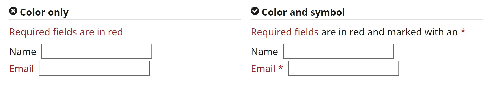

## A Reflection on Accessibility in Technology Design

Cassandra Parent

_For all text-based citations, please click on the super scripts to be taken the reference. For images and videos, click the content to be redirected to the source page._

## The Problem
Inclusive and accessible design is aimed to accomodate the diverse abilities of people.[1](https://www.sciencedirect.com/science/article/pii/S0142694X1730087X) There are many reasons that traditional technology may not be inclusive of people with disabilities including complicated instructions, lack of visual aides, and inconsistent navigation.[2](https://content.iospress.com/articles/technology-and-disability/tad00242) Despite simple technology changes being transformative for disadvantaged communities, mainstream personal technologies still largely remain inaccessible.[3](https://dl.acm.org/doi/abs/10.1145/3178855?casa_token=fCefw1GO1d0AAAAA:aDsxFfi060wTbTZ1LabQdP_dUklkE7ILuYbwNMQba8xhFRWrnvN7gDdkmFqt3EytKJdw5VTDDOye2w) Oftentimes, these mainstream designers will just do the bare minimum to satisfy the legal requirements for accessibility.[3](https://dl.acm.org/doi/abs/10.1145/3178855?casa_token=fCefw1GO1d0AAAAA:aDsxFfi060wTbTZ1LabQdP_dUklkE7ILuYbwNMQba8xhFRWrnvN7gDdkmFqt3EytKJdw5VTDDOye2w) 

However, the following video discusses how accessible design is not only extremely beneficial for users, but also greatly expands user bases of technologies. As the video explains, with one in five people having some sort of disability, having accessible design is important for commercial success. 

<iframe width="560" height="315" src="https://www.youtube.com/embed/dJfhi2P60Xo" title="YouTube video player" frameborder="0" allow="accelerometer; autoplay; clipboard-write; encrypted-media; gyroscope; picture-in-picture" allowfullscreen></iframe>

## Development

When developing accessible technology, it is important to consider that a wide range of disabilities exist, and that different disabilities come with different needs.[4](https://www.researchgate.net/publication/233608298_Conducting_Usability_Studies_with_Users_Who_Are_Elderly_or_Have_Disabilities) Conducting usabilitiy studies with people who have a wide range of abilities is one of the best ways to ensure that your design is inclusive and accessible.[4](https://www.researchgate.net/publication/233608298_Conducting_Usability_Studies_with_Users_Who_Are_Elderly_or_Have_Disabilities)
 Click [here](https://a11yrules.com/series/a11y-rules-soundbite/) to listen to a variety of short podcasts where disabled users talk about their diverse challenges when interacting with online technologies. By listening to these experiences, a better understanding of the diversity of needs can be gained which is essential when desiging a new technology.  

In addition, having a diverse development team can allow for a more holistic perspective to be incorporated into the final design. Click [here](https://www.a11yproject.com/posts/2021-10-11-how-i-deal-with-colorblindness-as-a-digital-product-designer/) to read about a colorblind designer's perspective on the challenges and advantages of his disability in design groups. 

## Implementation
While there is a broad range of diabilities, there are a few simple things you can do to make your designs more accessible.[2](https://content.iospress.com/articles/technology-and-disability/tad00242) For instance, you can increase the contrast in your designs so people with visual impairments can better understand your content. 

Another thing that could help individuals with visual impairments is to not just using color to indicate a task. Adding text or symbol descriptions can make these features more accessible.

People with audio impairments have different needs. For them, adding a transcript option or closed captioning on a video can be really beneficial.

Keep in mind that these changes also benefit users without disabilities: if you're watching a video in a loud setting, maybe you'll turn on the captions for your own understanding. In this way, accessibility also links to universal design which integrates accessible technologies into daily life.[3](https://dl.acm.org/doi/abs/10.1145/3178855?casa_token=fCefw1GO1d0AAAAA:aDsxFfi060wTbTZ1LabQdP_dUklkE7ILuYbwNMQba8xhFRWrnvN7gDdkmFqt3EytKJdw5VTDDOye2w)  

While these are a couple of examples for universal design, this certainly isn't a comprehensive list. Please click [here](https://www.a11yproject.com/checklist/) to find a much more thorough checklist of accessible design guidelines. 

## Designing for Joy
While integrating accessible technology into essential web services is great, it is also important to look beyond traditional accessibility applications.[5](https://link.springer.com/chapter/10.1007/978-3-319-20916-6_38) This is because while accessible technology is becoming more prevalent in essential web services, there still are very few accessible technologies designed for recreational use.[5](https://link.springer.com/chapter/10.1007/978-3-319-20916-6_38)

For instance, video games act as creative, emotional, and social outlets and bring joy to many individuals.[6](https://link.springer.com/chapter/10.1007/978-3-030-23560-4_22) However, video games remain inaccessible for a majority of people with disabilities.[6](https://link.springer.com/chapter/10.1007/978-3-030-23560-4_22) Many popular video games still do not have transcriptions for audio cues, use too small fonts, and do not provide easier difficulty levels.[7](https://journals.sagepub.com/doi/full/10.1177/1555412020971500)

A group of students altered the game _Bubble Trip_ (pictured below) to make it more accessible for individuals who are low-vision or blind.[6](https://link.springer.com/chapter/10.1007/978-3-030-23560-4_22)

Students did this by adding sonification that explained things like game instructions, the current objective, and fish motion.[6](https://link.springer.com/chapter/10.1007/978-3-030-23560-4_22) This serves as an important proof of concept that that video games can be accessible for a broad audience. However, it is important that accessible changes are made by large gaming companies so that individuals with disabilities can be included in these popular social activities. 

## Improvement
While these tips and resources are great to get start in accessible design, as a designer, it is important to continue to learn about accessibility and how it can best be achieved. [Here](https://www.a11yproject.com/resources/) is a compilation of resources including books, software packages, conferences, and more that are all about accessible design. By continuing to educate ourselves, we can become better and more inclusive designers. 
